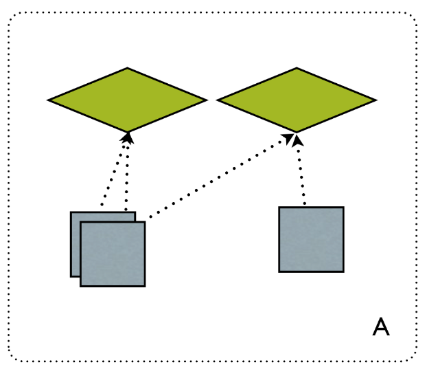
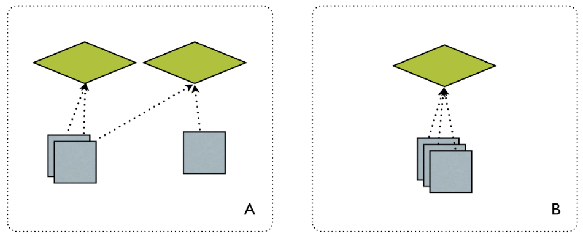
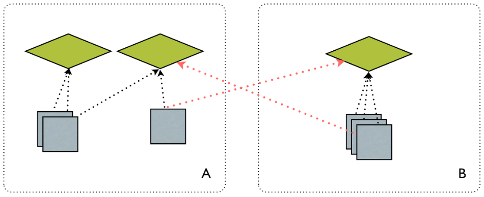
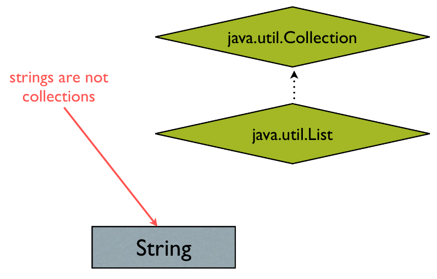
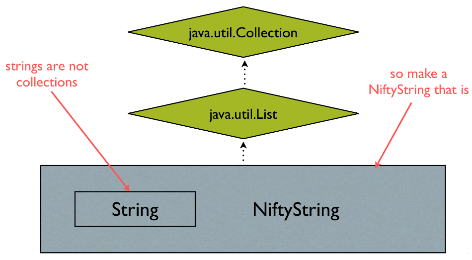
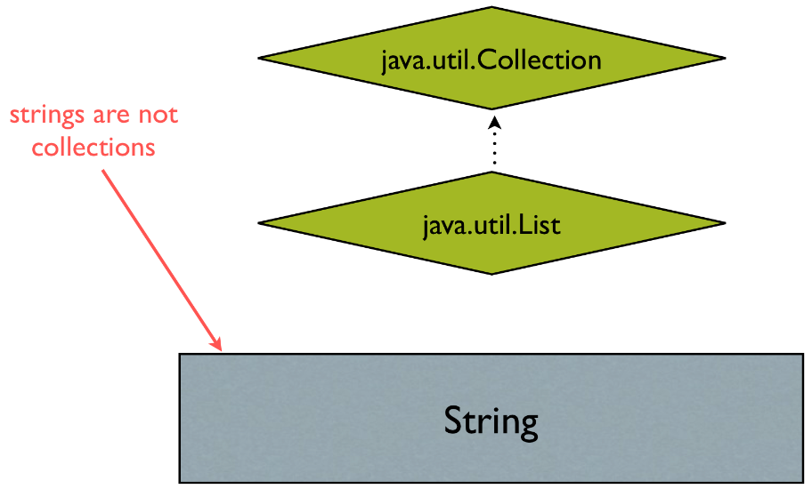
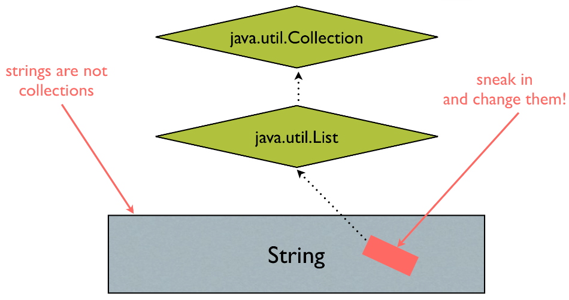
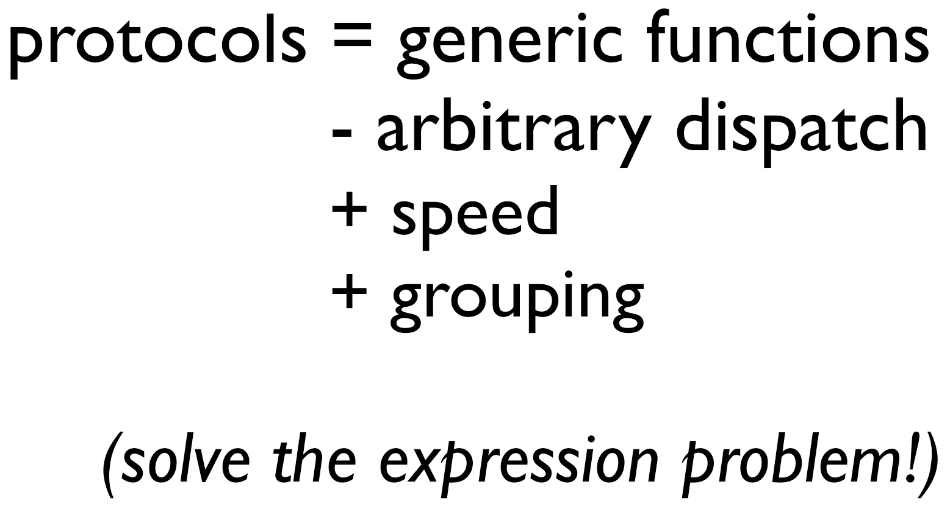

!SLIDE
#The Expression Problem#

!SLIDE center
#The Expression Problem#

!SLIDE center
#The Expression Problem#

!SLIDE center
#The Expression Problem#

!SLIDE center
#The Expression Problem#

###A should be able to work with B's abstractions, and vice versa,###
###**without modification of the original code**###

!SLIDE bullets incremental
#A can't inherit from B#

* A is newer than B
* A is hard to change
* We don't control A

!SLIDE
#Some approaches to the Expression Problem#

!SLIDE center
#1. Wrappers#

!SLIDE center
#1. Wrappers#

!SLIDE bullets incremental
#Wrappers add complexity#

* Ruin identity
* Ruin equality
* Causes non-local defects
* Don't compose

!SLIDE center
#2. Monkey Patching#

!SLIDE center
#2. Monkey Patching#

!SLIDE bullets incremental
#Monkey patching adds complexity#

* Preserves identity (barely)
* Ruins namespacing
* Causes non-local defects
* Not allowed in many languages

!SLIDE
#Clojure's Solutions#

!SLIDE bullets incremental
#Generic functions#

* Dispatch to an arbitrary function of the first argument
* Polymorphism lives in the functions
* Preserves namespacing

!SLIDE
#Example#

!SLIDE bullets incremental
#Drawbacks of multimethods#
* Performance

!SLIDE bullets incremental
#Protocols#

* The best of all the worlds

!SLIDE center
#Protocols#

!SLIDE
#Example#
