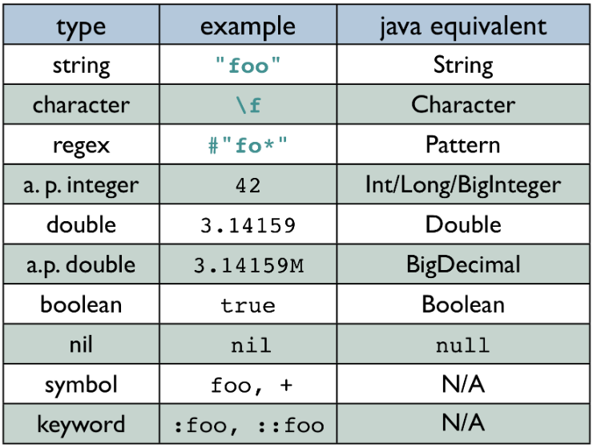
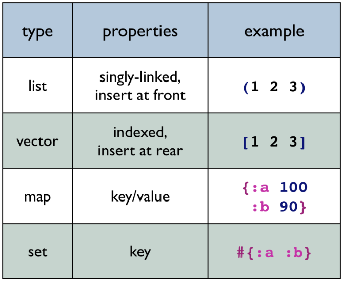
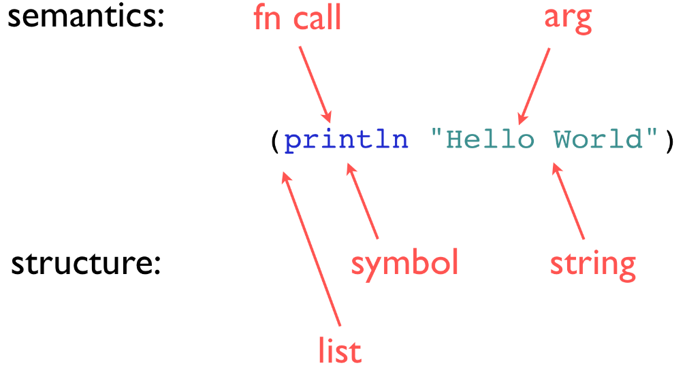
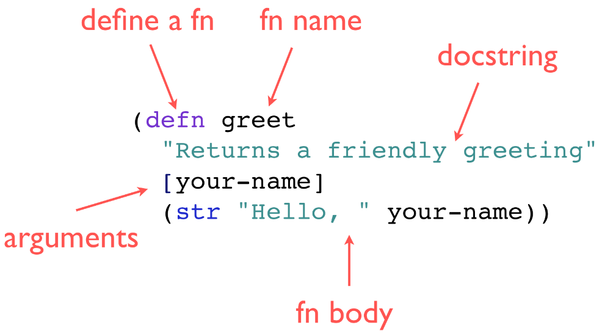
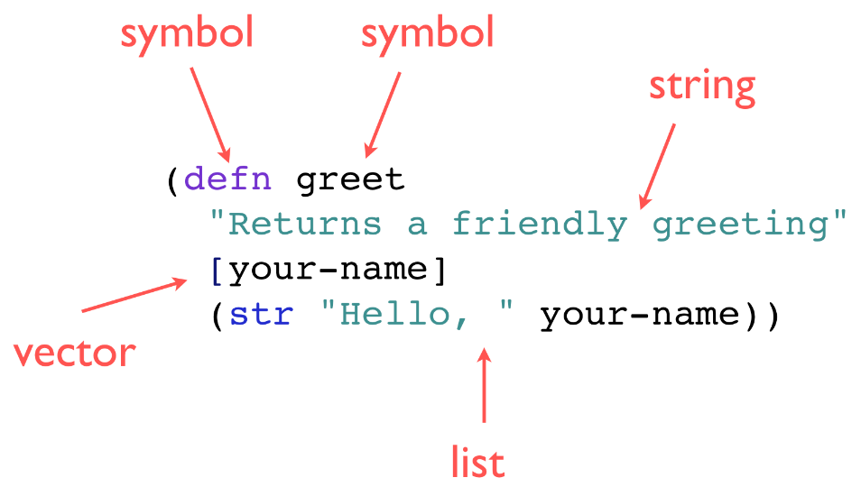
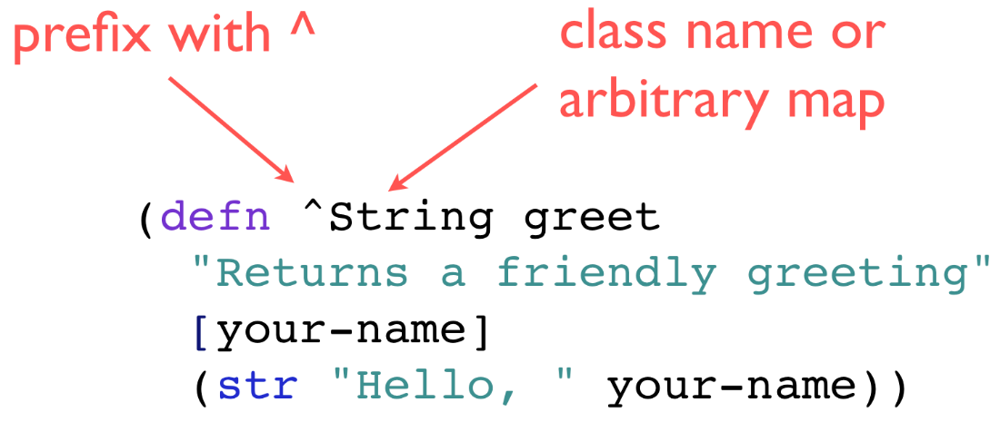

!SLIDE
#Reading Clojure Code#

!SLIDE center
#Atomic Data Types#

!SLIDE center
#Data Literals#

!SLIDE center
#Function Call#

!SLIDE center
#Function Definition#

!SLIDE center
#It's all data!#

!SLIDE center
#Metadata#

